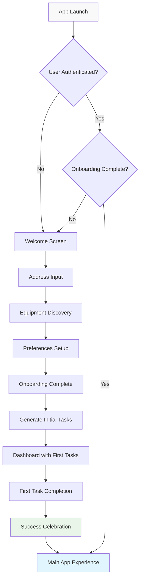
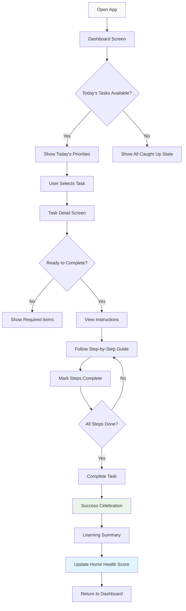

# HomeKeeper User Flows and Navigation
**Complete Navigation Architecture & User Journey Mapping**

*"Good navigation is invisible. Great navigation is inevitable." - Luke Wroblewski*

---

**Document:** User Flows and Navigation  
**Date:** June 11, 2025  
**Version:** 1.0 - React Native Implementation Guide  
**Target:** Week 3 Navigation Excellence

---

## 🗺️ **Navigation Architecture Overview**

### **React Navigation 6 Structure**

```typescript
// src/navigation/types.ts
export type RootStackParamList = {
  // Onboarding Stack
  Onboarding: NavigatorScreenParams<OnboardingStackParamList>;
  
  // Main App Stack  
  MainApp: NavigatorScreenParams<MainTabParamList>;
  
  // Modal Stack
  TaskDetail: { taskId: string };
  TaskCompletion: { taskId: string; completedSteps: number; totalSteps: number };
  TaskReschedule: { task: Task };
  AddTask: undefined;
  AddEquipment: undefined;
  Settings: undefined;
  Profile: undefined;
  HelpSupport: undefined;
};

export type OnboardingStackParamList = {
  Welcome: undefined;
  AddressInput: undefined;
  EquipmentDiscovery: undefined;
  Preferences: undefined;
  OnboardingComplete: undefined;
};

export type MainTabParamList = {
  HomeTab: NavigatorScreenParams<HomeStackParamList>;
  TasksTab: NavigatorScreenParams<TasksStackParamList>;
  EquipmentTab: NavigatorScreenParams<EquipmentStackParamList>;
  CalendarTab: NavigatorScreenParams<CalendarStackParamList>;
};

export type HomeStackParamList = {
  Dashboard: undefined;
  HomeHealthDetails: undefined;
  WeatherInsights: undefined;
  MaintenanceHistory: undefined;
};

export type TasksStackParamList = {
  TaskList: undefined;
  TaskSearch: undefined;
  TaskFilters: undefined;
};

export type EquipmentStackParamList = {
  EquipmentList: undefined;
  EquipmentDetail: { equipmentId: string };
  EquipmentHistory: { equipmentId: string };
};

export type CalendarStackParamList = {
  CalendarView: undefined;
  ScheduleManagement: undefined;
  WeekView: undefined;
  MonthView: undefined;
};
```

### **Navigation Implementation**

```typescript
// src/navigation/RootNavigator.tsx
import { NavigationContainer } from '@react-navigation/native';
import { createNativeStackNavigator } from '@react-navigation/native-stack';

const RootStack = createNativeStackNavigator<RootStackParamList>();

export const RootNavigator: React.FC = () => {
  const { isAuthenticated, isOnboardingComplete } = useAuth();

  return (
    <NavigationContainer>
      <RootStack.Navigator
        screenOptions={{
          headerShown: false,
          gestureEnabled: true,
          animation: 'slide_from_right',
        }}
      >
        {!isAuthenticated ? (
          <RootStack.Screen
            name="Auth"
            component={AuthNavigator}
            options={{ animationTypeForReplace: 'push' }}
          />
        ) : !isOnboardingComplete ? (
          <RootStack.Screen
            name="Onboarding"
            component={OnboardingNavigator}
            options={{ gestureEnabled: false }}
          />
        ) : (
          <>
            {/* Main App */}
            <RootStack.Screen
              name="MainApp"
              component={MainTabNavigator}
            />
            
            {/* Modal Screens */}
            <RootStack.Group
              screenOptions={{
                presentation: 'modal',
                headerShown: true,
                gestureEnabled: true,
              }}
            >
              <RootStack.Screen
                name="TaskDetail"
                component={TaskDetailScreen}
                options={({ route }) => ({
                  title: 'Task Details',
                  headerBackTitle: 'Back',
                })}
              />
              
              <RootStack.Screen
                name="TaskCompletion"
                component={TaskCompletionScreen}
                options={{
                  title: 'Task Complete!',
                  gestureEnabled: false,
                  headerLeft: () => null,
                }}
              />
              
              <RootStack.Screen
                name="AddTask"
                component={AddTaskScreen}
                options={{
                  title: 'Add Task',
                  headerRight: () => (
                    <HeaderButton title="Cancel" onPress={() => navigation.goBack()} />
                  ),
                }}
              />
            </RootStack.Group>
          </>
        )}
      </RootStack.Navigator>
    </NavigationContainer>
  );
};
```

---

## 🚀 **User Flow 1: First Time User Onboarding**

### **Flow Overview**
**Goal:** Transform first-time user from overwhelmed to confident home maintenance partner  
**Success Criteria:** 90%+ complete onboarding, 80%+ complete first task within 7 days

### **Flow Diagram**


### **Detailed Flow Implementation**

#### **Step 1: Welcome Screen Entry**
```typescript
// src/screens/onboarding/WelcomeScreen.tsx
const WelcomeScreen: React.FC = () => {
  const navigation = useNavigation<OnboardingNavigationProp>();
  const { trackEvent } = useAnalytics();

  const handleGetStarted = () => {
    trackEvent('onboarding_welcome_started');
    navigation.navigate('AddressInput');
  };

  return (
    <OnboardingContainer>
      <WelcomeAnimation>
        <LottieView
          source={require('../../assets/animations/welcome-hero.json')}
          autoPlay
          loop={false}
          style={styles.heroAnimation}
        />
      </WelcomeAnimation>
      
      <WelcomeContent>
        <AppLogo />
        <WelcomeTitle>Welcome to HomeKeeper</WelcomeTitle>
        <WelcomeSubtitle>
          Transform home maintenance from overwhelming to empowering
        </WelcomeSubtitle>
        
        <BenefitsList>
          <BenefitItem>
            <CheckIcon name="checkmark-circle" color={Colors.success} />
            <BenefitText>Know exactly what needs doing</BenefitText>
          </BenefitItem>
          <BenefitItem>
            <CheckIcon name="checkmark-circle" color={Colors.success} />
            <BenefitText>Get perfect timing recommendations</BenefitText>
          </BenefitItem>
          <BenefitItem>
            <CheckIcon name="checkmark-circle" color={Colors.success} />
            <BenefitText>Learn how to do it safely</BenefitText>
          </BenefitItem>
        </BenefitsList>
      </WelcomeContent>
      
      <WelcomeActions>
        <PrimaryButton
          title="Get Started"
          onPress={handleGetStarted}
          icon="arrow-forward"
        />
        <SecondaryButton
          title="I already have an account"
          onPress={() => navigation.navigate('Login')}
        />
      </WelcomeActions>
    </OnboardingContainer>
  );
};
```

#### **Step 2: Address Input with Validation**
```typescript
// src/screens/onboarding/AddressInputScreen.tsx
const AddressInputScreen: React.FC = () => {
  const [address, setAddress] = useState('');
  const [isValidating, setIsValidating] = useState(false);
  const [validationError, setValidationError] = useState('');
  
  const { validateAddress, saveUserAddress } = useAddressService();
  const { trackEvent } = useAnalytics();

  const handleContinue = async () => {
    if (!address.trim()) {
      setValidationError('Please enter your address');
      return;
    }

    setIsValidating(true);
    setValidationError('');

    try {
      const validatedAddress = await validateAddress(address);
      await saveUserAddress(validatedAddress);
      
      trackEvent('onboarding_address_completed', {
        address_type: validatedAddress.type,
        has_basement: validatedAddress.hasBasement,
        home_age: validatedAddress.estimatedAge,
      });
      
      navigation.navigate('EquipmentDiscovery', {
        homeDetails: validatedAddress,
      });
    } catch (error) {
      setValidationError('Please check your address and try again');
      trackEvent('onboarding_address_validation_failed', {
        error: error.message,
      });
    } finally {
      setIsValidating(false);
    }
  };

  return (
    <OnboardingContainer>
      <ProgressIndicator currentStep={1} totalSteps={4} />
      
      <AddressInputContent>
        <StepHeader>
          <StepIcon>🏠</StepIcon>
          <StepTitle>Your Home</StepTitle>
          <StepDescription>
            Tell us your address to get personalized maintenance recommendations
          </StepDescription>
        </StepHeader>

        <AddressForm>
          <AddressInput
            label="Home Address"
            placeholder="123 Main Street, City, State"
            value={address}
            onChangeText={setAddress}
            error={validationError}
            autoComplete="street-address"
            autoCapitalize="words"
            returnKeyType="done"
            onSubmitEditing={handleContinue}
          />
          
          <LocationButton onPress={handleUseCurrentLocation}>
            <LocationIcon name="location" color={Colors.primary} />
            <LocationText>Use Current Location</LocationText>
          </LocationButton>
        </AddressForm>

        <PrivacyAssurance>
          <ShieldIcon name="shield-checkmark" color={Colors.success} />
          <PrivacyText>Your address is encrypted and never shared</PrivacyText>
        </PrivacyAssurance>
      </AddressInputContent>

      <OnboardingActions>
        <PrimaryButton
          title="Continue"
          onPress={handleContinue}
          loading={isValidating}
          disabled={!address.trim() || isValidating}
        />
        <SkipButton onPress={() => navigation.navigate('EquipmentDiscovery')}>
          Skip for now
        </SkipButton>
      </OnboardingActions>
    </OnboardingContainer>
  );
};
```

#### **Step 3: Equipment Discovery with AI**
```typescript
// src/screens/onboarding/EquipmentDiscoveryScreen.tsx
const EquipmentDiscoveryScreen: React.FC = () => {
  const [discoveredEquipment, setDiscoveredEquipment] = useState<Equipment[]>([]);
  const [selectedEquipment, setSelectedEquipment] = useState<string[]>([]);
  const [isScanning, setIsScanning] = useState(false);
  
  const { route } = useRoute<EquipmentDiscoveryRouteProp>();
  const { homeDetails } = route.params || {};
  
  const { discoverEquipment, saveHomeEquipment } = useEquipmentService();

  useEffect(() => {
    if (homeDetails) {
      discoverEquipmentFromAddress();
    }
  }, [homeDetails]);

  const discoverEquipmentFromAddress = async () => {
    setIsScanning(true);
    try {
      const equipment = await discoverEquipment(homeDetails);
      setDiscoveredEquipment(equipment);
      // Pre-select common equipment
      setSelectedEquipment(equipment.filter(e => e.isCommon).map(e => e.id));
    } catch (error) {
      console.error('Equipment discovery failed:', error);
    } finally {
      setIsScanning(false);
    }
  };

  const handleContinue = async () => {
    try {
      await saveHomeEquipment(selectedEquipment);
      
      trackEvent('onboarding_equipment_selected', {
        equipment_count: selectedEquipment.length,
        equipment_types: selectedEquipment.map(id => 
          discoveredEquipment.find(e => e.id === id)?.type
        ),
      });
      
      navigation.navigate('Preferences');
    } catch (error) {
      Alert.alert('Error', 'Failed to save equipment. Please try again.');
    }
  };

  return (
    <OnboardingContainer>
      <ProgressIndicator currentStep={2} totalSteps={4} />
      
      <EquipmentDiscoveryContent>
        <StepHeader>
          <StepIcon>🔍</StepIcon>
          <StepTitle>Equipment Discovery</StepTitle>
          <StepDescription>
            We've identified equipment in your home that needs regular maintenance
          </StepDescription>
        </StepHeader>

        {isScanning ? (
          <ScanningState>
            <ScanningAnimation />
            <ScanningText>Analyzing your home...</ScanningText>
          </ScanningState>
        ) : (
          <EquipmentGrid>
            {discoveredEquipment.map((equipment) => (
              <EquipmentCard
                key={equipment.id}
                equipment={equipment}
                selected={selectedEquipment.includes(equipment.id)}
                onToggle={(id) => {
                  setSelectedEquipment(prev =>
                    prev.includes(id)
                      ? prev.filter(eid => eid !== id)
                      : [...prev, id]
                  );
                }}
              />
            ))}
          </EquipmentGrid>
        )}

        <ManualAddButton onPress={() => setShowManualAdd(true)}>
          <PlusIcon name="add-circle" color={Colors.primary} />
          <ManualAddText>Add equipment manually</ManualAddText>
        </ManualAddButton>
      </EquipmentDiscoveryContent>

      <OnboardingActions>
        <PrimaryButton
          title="Continue"
          onPress={handleContinue}
          disabled={selectedEquipment.length === 0}
        />
        <SecondaryButton
          title="Skip Equipment Setup"
          onPress={() => navigation.navigate('Preferences')}
        />
      </OnboardingActions>
    </OnboardingContainer>
  );
};
```

---

## 📋 **User Flow 2: Daily Task Management**

### **Flow Overview**
**Goal:** Seamless task discovery, completion, and learning experience  
**Success Criteria:** 70%+ of daily tasks completed, 90%+ user satisfaction

### **Flow Diagram**


### **Task Management Implementation**

#### **Dashboard Task Display**
```typescript
// src/screens/main/DashboardScreen.tsx
const DashboardScreen: React.FC = () => {
  const { user } = useAuth();
  const { todayTasks, weeklyStats, homeHealth } = useDashboardData();
  const { completeTask } = useTaskActions();

  const handleTaskPress = (task: Task) => {
    navigation.navigate('TaskDetail', { taskId: task.id });
  };

  const handleQuickComplete = async (taskId: string) => {
    try {
      await completeTask(taskId);
      showSuccessAnimation();
      // Auto-refresh dashboard data
    } catch (error) {
      showErrorToast('Failed to complete task');
    }
  };

  return (
    <DashboardContainer>
      <DashboardHeader>
        <GreetingSection>
          <GreetingText>Good {getTimeOfDay()}, {user.firstName}!</GreetingText>
          <WeatherWidget />
        </GreetingSection>
      </DashboardHeader>

      <HomeHealthSection>
        <HomeHealthCard
          score={homeHealth.score}
          trend={homeHealth.trend}
          onPress={() => navigation.navigate('HomeHealthDetails')}
        />
      </HomeHealthSection>

      <TodayTasksSection>
        <SectionHeader>
          <SectionTitle>Today's Priorities</SectionTitle>
          <ViewAllButton onPress={() => navigation.navigate('Tasks', { filter: 'today' })}>
            View All
          </ViewAllButton>
        </SectionHeader>

        {todayTasks.length > 0 ? (
          <TasksList>
            {todayTasks.slice(0, 3).map((task) => (
              <SwipeableTaskCard
                key={task.id}
                task={task}
                onPress={() => handleTaskPress(task)}
                onSwipeComplete={() => handleQuickComplete(task.id)}
                onSwipeReschedule={() => navigation.navigate('TaskReschedule', { task })}
              />
            ))}
          </TasksList>
        ) : (
          <AllCaughtUpState>
            <CelebrationIcon>🎉</CelebrationIcon>
            <AllCaughtUpText>All caught up for today!</AllCaughtUpText>
            <AllCaughtUpSubtext>Check back tonight for tomorrow's tasks</AllCaughtUpSubtext>
          </AllCaughtUpState>
        )}
      </TodayTasksSection>

      <WeeklyInsights>
        <WeeklyStatsCard stats={weeklyStats} />
      </WeeklyInsights>
    </DashboardContainer>
  );
};
```

#### **Task Detail with Progressive Steps**
```typescript
// src/screens/tasks/TaskDetailScreen.tsx
const TaskDetailScreen: React.FC<TaskDetailProps> = ({ route }) => {
  const { taskId } = route.params;
  const [currentStep, setCurrentStep] = useState(0);
  const [completedSteps, setCompletedSteps] = useState<Set<number>>(new Set());
  const [showInstructions, setShowInstructions] = useState(false);

  const {
    task,
    instructions,
    safetyTips,
    requiredItems,
    loading,
  } = useTaskDetail(taskId);

  const progress = (completedSteps.size / instructions.length) * 100;
  const canComplete = completedSteps.size === instructions.length;

  const handleStepComplete = (stepIndex: number) => {
    setCompletedSteps(prev => new Set([...prev, stepIndex]));
    
    // Haptic feedback for step completion
    Haptics.impactAsync(Haptics.ImpactFeedbackStyle.Light);
    
    // Auto-advance to next incomplete step
    const nextIncompleteStep = instructions.findIndex((_, index) => 
      index > stepIndex && !completedSteps.has(index)
    );
    
    if (nextIncompleteStep !== -1) {
      setCurrentStep(nextIncompleteStep);
    }
  };

  const handleCompleteTask = async () => {
    if (!canComplete) return;

    try {
      await completeTask(taskId, {
        completedSteps: Array.from(completedSteps),
        timeSpent: getTaskTimeSpent(),
        learningNotes: getLearningNotes(),
      });

      navigation.navigate('TaskCompletion', {
        taskId,
        completedSteps: completedSteps.size,
        totalSteps: instructions.length,
      });
    } catch (error) {
      Alert.alert('Error', 'Failed to complete task. Please try again.');
    }
  };

  return (
    <TaskDetailContainer>
      <TaskDetailHeader>
        <BackButton onPress={() => navigation.goBack()} />
        <TaskTitle numberOfLines={1}>{task.title}</TaskTitle>
        <TaskMenu onPress={() => setShowTaskMenu(true)} />
      </TaskDetailHeader>

      <TaskOverview>
        <TaskPriorityBadge priority={task.priority} />
        <TaskDueDate dueDate={task.dueDate} />
        <TaskProgress progress={progress} />
      </TaskOverview>

      <TaskReadiness>
        <ReadinessTitle>Readiness Check</ReadinessTitle>
        <RequiredItemsList>
          {requiredItems.map((item, index) => (
            <RequiredItem
              key={index}
              item={item}
              available={task.availableResources?.includes(item.id)}
            />
          ))}
        </RequiredItemsList>
      </TaskReadiness>

      {showInstructions ? (
        <InstructionsView>
          <InstructionsHeader>
            <InstructionsTitle>Step-by-Step Instructions</InstructionsTitle>
            <StepCounter>
              {currentStep + 1} of {instructions.length}
            </StepCounter>
          </InstructionsHeader>

          <InstructionCard
            instruction={instructions[currentStep]}
            stepNumber={currentStep + 1}
            completed={completedSteps.has(currentStep)}
            onComplete={() => handleStepComplete(currentStep)}
          />

          <InstructionNavigation>
            <PreviousStepButton
              disabled={currentStep === 0}
              onPress={() => setCurrentStep(Math.max(0, currentStep - 1))}
            />
            <NextStepButton
              disabled={currentStep === instructions.length - 1}
              onPress={() => setCurrentStep(Math.min(instructions.length - 1, currentStep + 1))}
            />
          </InstructionNavigation>
        </InstructionsView>
      ) : (
        <TaskActions>
          <PrimaryButton
            title="Start Instructions"
            onPress={() => setShowInstructions(true)}
            icon="play"
          />
          <SecondaryButton
            title="Reschedule"
            onPress={() => navigation.navigate('TaskReschedule', { task })}
          />
        </TaskActions>
      )}

      {showInstructions && (
        <CompleteTaskButton>
          <PrimaryButton
            title="Mark Complete"
            onPress={handleCompleteTask}
            disabled={!canComplete}
            icon="checkmark"
          />
        </CompleteTaskButton>
      )}
    </TaskDetailContainer>
  );
};
```

---

## 🏠 **User Flow 3: Equipment Management**

### **Flow Overview**
**Goal:** Comprehensive equipment tracking with maintenance history  
**Success Criteria:** 60%+ users add photos, 80%+ track maintenance history

### **Equipment Management Implementation**

```typescript
// src/screens/equipment/EquipmentListScreen.tsx
const EquipmentListScreen: React.FC = () => {
  const [searchQuery, setSearchQuery] = useState('');
  const [selectedCategory, setSelectedCategory] = useState<EquipmentCategory>('all');
  
  const { equipment, categories, loading } = useEquipment();
  const filteredEquipment = useFilteredEquipment(equipment, searchQuery, selectedCategory);

  return (
    <EquipmentListContainer>
      <EquipmentListHeader>
        <SearchInput
          placeholder="Search equipment..."
          value={searchQuery}
          onChangeText={setSearchQuery}
          leftIcon="search"
        />
        <AddEquipmentButton onPress={() => navigation.navigate('AddEquipment')}>
          <Icon name="add" size={24} color={Colors.primary} />
        </AddEquipmentButton>
      </EquipmentListHeader>

      <CategoryFilter>
        <CategoryScroll horizontal showsHorizontalScrollIndicator={false}>
          {categories.map((category) => (
            <CategoryChip
              key={category.id}
              category={category}
              selected={selectedCategory === category.id}
              onPress={() => setSelectedCategory(category.id)}
            />
          ))}
        </CategoryScroll>
      </CategoryFilter>

      <EquipmentGrid>
        {filteredEquipment.map((item) => (
          <EquipmentCard
            key={item.id}
            equipment={item}
            onPress={() => navigation.navigate('EquipmentDetail', { equipmentId: item.id })}
          />
        ))}
      </EquipmentGrid>
    </EquipmentListContainer>
  );
};
```

---

## 📅 **Navigation Performance Optimization**

### **Lazy Loading Implementation**

```typescript
// src/navigation/LazyScreens.tsx
import { lazy } from 'react';

// Lazy load heavy screens
export const TaskDetailScreen = lazy(() => import('../screens/tasks/TaskDetailScreen'));
export const EquipmentDetailScreen = lazy(() => import('../screens/equipment/EquipmentDetailScreen'));
export const CalendarScreen = lazy(() => import('../screens/calendar/CalendarScreen'));

// Preload commonly used screens
const preloadScreens = [
  import('../screens/main/DashboardScreen'),
  import('../screens/tasks/TaskListScreen'),
];

export const preloadCommonScreens = () => {
  return Promise.all(preloadScreens);
};
```

### **Navigation State Management**

```typescript
// src/navigation/NavigationService.ts
import { createNavigationContainerRef, StackActions } from '@react-navigation/native';

export const navigationRef = createNavigationContainerRef<RootStackParamList>();

export const NavigationService = {
  navigate: (name: string, params?: any) => {
    if (navigationRef.isReady()) {
      navigationRef.navigate(name as never, params as never);
    }
  },

  goBack: () => {
    if (navigationRef.isReady() && navigationRef.canGoBack()) {
      navigationRef.goBack();
    }
  },

  replace: (name: string, params?: any) => {
    if (navigationRef.isReady()) {
      navigationRef.dispatch(StackActions.replace(name, params));
    }
  },

  reset: (routes: any[]) => {
    if (navigationRef.isReady()) {
      navigationRef.reset({
        index: routes.length - 1,
        routes,
      });
    }
  },
};
```

---

## ✅ **Navigation Implementation Checklist**

### **Core Navigation Setup**
- [ ] React Navigation 6 installed and configured
- [ ] TypeScript navigation types defined
- [ ] Stack, Tab, and Modal navigators implemented
- [ ] Navigation service for programmatic navigation
- [ ] Deep linking configuration

### **User Flow Implementation**
- [ ] Onboarding flow with progress tracking
- [ ] Main app navigation with tab persistence
- [ ] Task management flow with step tracking
- [ ] Equipment management with search/filter
- [ ] Settings and profile management

### **Performance Optimization**
- [ ] Lazy loading for heavy screens
- [ ] Screen preloading for common paths
- [ ] Navigation state persistence
- [ ] Memory management for modal stacks
- [ ] Gesture optimization for smooth transitions

### **Quality Assurance**
- [ ] Navigation tested on all device sizes
- [ ] Back button handling on Android
- [ ] Deep link testing and validation
- [ ] Accessibility navigation support
- [ ] Performance testing with complex flows

---

**This navigation architecture provides the complete foundation for HomeKeeper's user experience flows. Every transition, screen, and interaction is designed to feel natural, fast, and purposeful while maintaining the revolutionary simplicity that defines HomeKeeper.** 🗺️ 